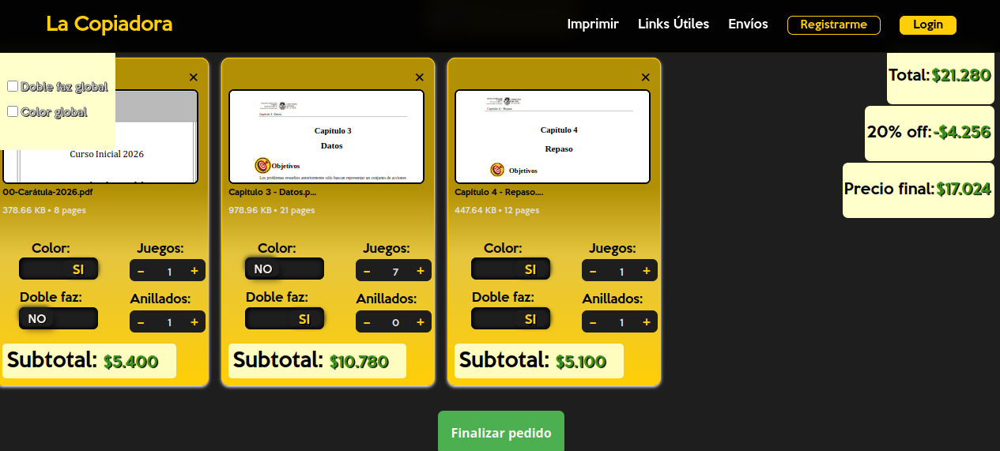

# La Copiadora - Plataforma de Gestión de Impresiones

> **Estado del proyecto:** Archivo histórico. El desarrollo alcanzó una fase funcional de MVP (Producto Mínimo Viable) antes del cese de operaciones físicas de la empresa en 2025.

## 📖 Contexto
La Copiadora fue una empresa con 6 años de trayectoria en La Plata. Ante la digitalización de documentos académicos y burocráticos, el negocio enfrentó el desafío de centralizar pedidos que llegaban dispersos por WhatsApp y Gmail, generando cuellos de botella.

Esta web nació como la solución para automatizar la recepción de trabajos y el cálculo de presupuestos sin intervención humana.

## 🚀 Funcionalidades Principales

### Para el Usuario:
* **Presupuestador Inteligente:** El usuario sube sus archivos PDF y selecciona preferencias en tiempo real:
    * Tipo de impresión (Doble/Simple faz).
    * Color o Blanco y Negro.
    * Cálculo automático de descuentos por cantidad.
* **Gestión de Envíos:** Opción de entrega a domicilio integrada en el flujo de pago.
* **Sistema de Cuentas:** Registro y logueo de usuarios para historial de pedidos.

### Para la Administración:
* **Panel de Comandas:** Visualización y gestión de pedidos entrantes para optimizar el flujo de trabajo en el local.

## 🛠️ Tecnologías Usadas
* **Frontend:** React (Arquitectura de Single Page Application - SPA).
* **Backend & Auth:** Supabase (PostgreSQL + Auth service).
* **Estilos:** Module Css.
* **Modularización:** El proyecto fue atomizado en componentes reutilizables para facilitar el mantenimiento.

---

## 📸 Vista Previa
<p align="center">
  
  
</p>

## 🛠️ Desafíos Técnicos: El Presupuestador de PDFs

La funcionalidad principal del proyecto es un **motor de cálculo de presupuestos en tiempo real**. A diferencia de un e-commerce convencional, el precio no es estático: se calcula dinámicamente analizando los metadatos de los archivos cargados por el usuario.

### 📄 Procesamiento de Archivos en el Cliente
Para garantizar una respuesta instantánea y reducir la carga del servidor, el procesamiento se realiza íntegramente en el frontend:

* **Análisis de Metadatos:** Utilicé `react-pdf` y `pdfjs-dist` para extraer el número exacto de páginas de cada archivo PDF tan pronto como el usuario lo selecciona.
* **Gestión de Estado Complejo:** Implementé un sistema de *custom hooks* (`useOrderCard` y `useOrderList`) para sincronizar las configuraciones individuales de cada archivo con los totales globales del pedido.
* **Previsualización Dinámica:** Se integró una vista previa de la primera página de cada PDF para que el usuario identifique visualmente sus archivos antes de confirmar.

### 💰 Lógica de Precios Dinámica
El sistema aplica reglas de negocio específicas del rubro gráfico:

* **Optimización por Doble Faz:** El algoritmo distingue entre páginas (contenido) y hojas (papel físico), calculando el costo base según el uso de papel.
* **Validación de Restricciones Físicas:** El sistema incluye alertas que impiden configuraciones técnicamente imposibles, como exceder el límite de hojas para un anillado estándar (800 páginas en doble faz o 400 en simple faz).
* **Escalabilidad de Descuentos:** Implementé una función que aplica automáticamente hasta un **40% de descuento** sobre el total del pedido basándose en umbrales de facturación configurables.

### Fragmento de Lógica: Cálculo de Costo Base
```javascript
// Lógica para determinar el costo base considerando páginas impares en impresión doble faz
if (doubleSided) {
  if (numPages === 1) {
    baseCost = pricePerPage;
  } else if (numPages % 2 === 0) {
    baseCost = (numPages / 2) * pricePerPage;
  } else {
    // Si es impar, se compensa la hoja física extra
    baseCost = ((numPages + 1) / 2) * pricePerPage;
  }
}

